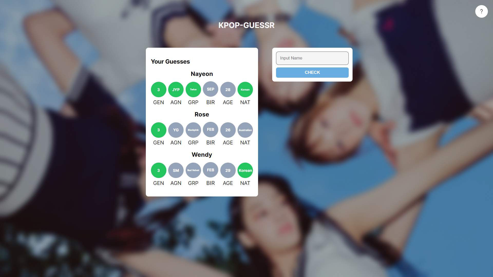
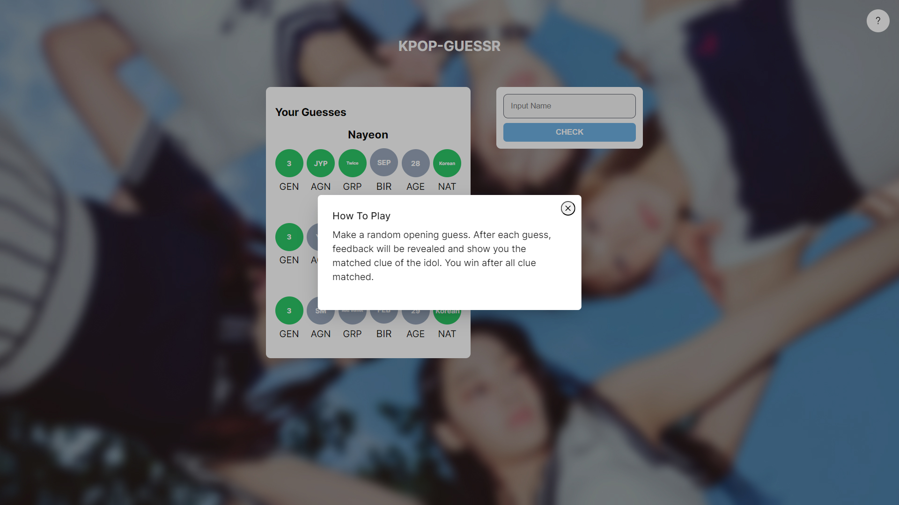

# KPOP - GUESSR
Welcome to KPOP-GUESSR. KPOP-GUESSR is a web-based guessing game built on Next.Js. This Game challenges users to guess their favorite K-pop idols. Test your knowledge and having fun identifying the idols.

## How To Play
1. Navigate to the game page [[kpop-guessr.vercel.app](https://kpop.guessr.vercel.app/)]
2. Start by make a guess of a K-pop idol.
3. Based on your response, The Game will provide feedback and highlight the correct clue.
4. Use the information from the feedback to guess the secret idol.

## About The Game
- This Game is inspired by Wordle.
- All K-pop data is obtained manually. If any data is wrong, feel free to contact me.

## Technologies Used
- Next JS (Framework)
- MongoDB (Database)
- Vercel (Deployment)

## Documentation

